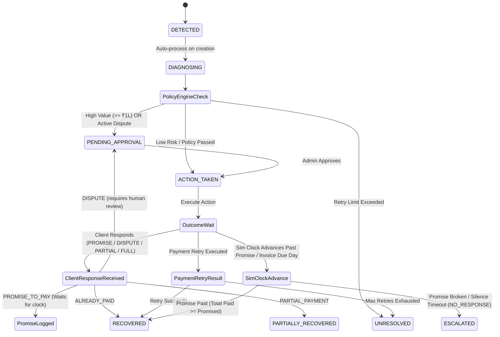

# ReclaimAI — Autonomous Revenue Recovery Agent

An autonomous, bounded revenue-recovery system. It detects revenue at risk — overdue B2B invoices and failed consumer payments — diagnoses the cause, decides on the right intervention, executes it within policy limits, and verifies whether the money actually came back. Every decision is logged to a full audit trail.

Built for the **Razorpay AI Buildathon** (Track 3 — AI Revenue Recovery).

**Live demo:** [https://recover-revenue.vercel.app](https://recover-revenue.vercel.app)

---

## The problem

Revenue loss rarely happens in one clean step. A payment fails, a client goes quiet on an invoice, a promise to pay gets broken. Chasing each of these down is usually manual, inconsistent, and undocumented — nobody can tell you *why* a given account was chased a certain way, or whether the approach that worked last time is being repeated.

This project closes that loop end to end: **detect → diagnose → decide → act → verify → recover or escalate** — with AI doing the reasoning and deterministic code controlling anything that actually touches money.

---

## Core architectural principle

**AI only classifies and recommends. It never executes.**

Every AI recommendation passes through a separate, deterministic policy engine before anything happens. The policy engine enforces:

- A hard amount threshold (₹1,00,000) above which a case requires human approval, regardless of what the AI recommends
- A retry limit, after which a case stops and closes as unresolved instead of being chased indefinitely
- Mandatory human review on any disputed case
- A safe fallback if the AI is unavailable — the system never guesses and moves money on a hunch; it defers to a human instead

This AI/policy split, and where a human is deliberately inserted into the loop, is the single most important design decision in the project — and it's visible in the product itself via the **Decision Trace** panel on every case (see below).

---

## Execution flow & state machine



---

## Two verticals, one engine

Rather than build two separate systems, both recovery types share a single state machine and audit infrastructure:

- **B2B receivables** (primary track) — chases overdue invoices. Supports branching client responses (promise to pay, dispute, partial payment, already paid, silence) — each drives a different next action.
- **Payment failure recovery** (proof the engine generalizes) — diagnoses a failed consumer payment and retries it within a bounded limit.

Both run on a shared core (`Case`, `RecoveryAction`, `AuditEvent`, `Promise`, `Payment`) with slim domain-specific tables (`Invoice`, `PaymentAttempt`) layered on top — one engine, not two parallel systems.

---

## How this connects to production

`POST /cases` and `POST /cases/:id/respond` are not demo-only endpoints — they're the real ingestion points a production deployment would use:

- **Payment failures** would arrive via a payment gateway webhook (e.g. Razorpay's `payment.failed` event) hitting a listener that calls the same case-creation path already built here.
- **B2B receivables** would arrive either from an accounting/invoicing system's API (QuickBooks, Zoho Books, etc.) or a scheduled job polling for invoices that just crossed their due date unpaid.
- **Client responses** would come from a support agent logging a reply through a UI form calling the existing `/respond` endpoint, or, as a further extension, an NLP layer classifying inbound email/SMS replies automatically — a genuinely harder problem, and explicitly out of scope here.

The batch scenario generator (`POST /batch/run`) is a synthetic-data tool for demonstration only — the equivalent of seeding a staging database — not a production data path.

---

## Key features

- **Deterministic policy engine** gating every AI recommendation — amount thresholds, retry limits, dispute handling, AI-unavailable fallback
- **Bounded retry logic** for payment failures — retries up to a limit, then stops and closes as unresolved (a real, testable stopping rule, not just a config value that's never exercised)
- **Client-response branching** for B2B cases — promise/dispute/partial/already-paid/silence, each with distinct downstream behavior
- **Simulation clock** — advances a shared simulated timeline so time-dependent behavior (a broken promise, an overdue invoice going silent) is demoable without waiting real days
- **Silence detection** — a B2B case whose client never responds and whose invoice is now overdue gets automatically escalated to a human, no manual trigger required
- **Human approval gate** — high-value and disputed cases pause for an admin's explicit decision before anything executes; enforced server-side via role-based guards, not hidden in the frontend
- **Full audit trail** — every diagnosis, policy decision, action, and outcome is logged and viewable per-case or as a global paginated feed
- **Batch scenario generation** — a library of named, scripted scenarios (quick recovery, broken promise, dispute, silence, high-value approval, partial payment, retry-recovers, retry-exhausted) that exercise every path the system supports, used to generate a realistic, explainable dataset rather than relying on pure randomness
- **Real recovery metrics** — recovered ₹ is summed from actual payment records (including partials), recovery rate is calculated only over concluded cases, and B2B/payment-failure performance is reported separately

---

## The Decision Trace

Every case detail page shows a five-stage trace:

**AI diagnosis → Policy evaluation → Authorization → Action execution → Outcome**

Each stage is populated from real audit data — the AI's actual stated classification and reasoning, the policy engine's actual verdict and why, whether human approval was required and by whom it was granted, which action actually executed, and the case's current real status. This is the architecture's core claim made visible and inspectable on every single case, not just asserted in a slide.

---

## Tech stack

**Backend**
- NestJS + TypeScript
- Prisma ORM (**pinned to 6.19.0** — Prisma 7 introduced breaking datasource config changes)
- PostgreSQL via Supabase (Session Pooler connection — Supabase's direct connection is IPv6-only and unreliable on many networks)
- JWT authentication (`@nestjs/passport`), enforced entirely server-side
- Groq API (`openai/gpt-oss-120b`) for AI diagnosis, with a deterministic fallback path if the API is unavailable

**Frontend**
- React + TypeScript + Vite
- Tailwind CSS, custom design tokens (see Design system below)
- Recharts for the recovery-over-time visualization
- React Router, plain React Context for auth and simulation-clock state (no external state library — kept deliberately simple)

**Auth model**
- Two roles: `ADMIN` (can approve high-risk/disputed cases) and `REVIEWER` (read-only). No public signup — this is an internal operations tool.

---

## API reference

| Method | Endpoint | Auth Guard | Description |
| :--- | :--- | :--- | :--- |
| `POST` | `/auth/login` | Public | Authenticates user and returns JWT token |
| `GET` | `/cases` | `JwtAuthGuard` | Lists all recovery cases |
| `GET` | `/cases/:id` | `JwtAuthGuard` | Retrieves single case detail with full Decision Trace & audit history |
| `POST` | `/cases` | `JwtAuthGuard` | Creates and auto-processes a new recovery case |
| `POST` | `/cases/:id/approve` | `ADMIN` only | Admin approval for `PENDING_APPROVAL` cases |
| `POST` | `/cases/:id/respond` | `JwtAuthGuard` | Records client response (promise, dispute, partial, paid) |
| `POST` | `/cases/sim/advance-and-resolve` | `JwtAuthGuard` | Advances simulation clock & resolves due promises & silence timeouts |
| `GET` | `/cases/metrics` | `JwtAuthGuard` | Summary metrics: total recovered ₹, recovery rate, breakdown by type |
| `GET` | `/cases/metrics/timeseries` | `JwtAuthGuard` | Cumulative recovered money per simulated day for timeline charts |
| `POST` | `/batch/run` | `ADMIN` only | Executes named scenario templates to generate a full benchmark dataset |
| `GET` | `/audit-log` | `JwtAuthGuard` | Paginated global audit log feed with optional `eventType` filtering |

---

## Design system — "Clearing"

A light, precise, restrained visual language deliberately built to avoid generic AI-tool defaults: cool paper background (not warm cream), a single confident forest-green accent, hairline dividers instead of card shadows, Fraunces serif reserved for hero figures and page titles, IBM Plex Sans for everything else, sentence-case labels throughout, tabular numerals on every money figure.

---

## Project structure

```
backend/
  prisma/
    schema.prisma          — full data model
    seed.ts                 — creates the initial admin user
  src/
    auth/                   — JWT auth, guards, role-based access
    prisma/                 — Prisma service, globally injectable
    sim-clock/               — simulated day counter
    recovery-engine/
      ai-diagnosis.service.ts    — calls Groq, validates output, falls back safely
      policy-engine.service.ts   — pure deterministic rules, no side effects
      recovery-engine.service.ts — the orchestrator / state machine
      cases.controller.ts        — case CRUD, metrics, process/approve/respond
    batch/                   — named scenario templates for synthetic data
    audit-log/                — global paginated audit feed

frontend/
  src/
    lib/                     — API client, auth context, sim-clock context, formatters
    components/               — Sidebar, Header, StatusBadge, Table, Card, Button
    pages/
      Overview.tsx             — KPIs, recovery-over-time chart, recent cases
      RecoveryCases.tsx         — filterable, type-adaptive case list
      CaseDetail.tsx            — Decision Trace, full audit timeline
      Approvals.tsx             — pending human-approval queue (ADMIN only)
      AuditLog.tsx              — global paginated event feed
```

---

## Running locally

### 1. Backend Setup

```bash
cd backend
npm install
cp .env.example .env   # fill in DATABASE_URL, JWT_SECRET, GROQ_API_KEY
npx prisma generate
npx prisma migrate dev
npx ts-node prisma/seed.ts   # one-time local seed to create default admin user
npm run start:dev
```

### 2. Frontend Setup

```bash
cd frontend
npm install
cp .env.example .env   # configure VITE_API_BASE_URL (defaults to http://localhost:3000)
npm run dev
```

### 3. Generate Benchmark Batch Dataset (Quick Demo Seed)

Log in to the dashboard at `http://localhost:5173` using the seeded admin credentials (or trigger via API):

```bash
curl -X POST http://localhost:3000/batch/run \
  -H "Authorization: Bearer <ADMIN_JWT_TOKEN>" \
  -H "Content-Type: application/json" \
  -d '{"countPerTemplate": 2}'
```
*This creates and resolves 18 benchmark cases exercising all 9 scenario templates, immediately populating the Overview dashboard with real recovery metrics.*

---

## What's out of scope

Built deliberately narrow given the timeline, and documented honestly:

- No real payment gateway integration — all recovery actions are simulated (the state machine, policy decisions, and audit trail are real; the actual message/retry send is not wired to a live provider)
- No queue/worker infrastructure — processing is synchronous by design, a considered simplicity tradeoff, not an oversight
- No multi-tenant support — this is a single-organization internal tool
- Payment-failure recovery is scoped narrowly to detect → diagnose → bounded retry → verify (no checkout-abandonment or subscription-billing handling, to keep the build focused rather than sprawling into three separate products)

---

## Why this approach

The brief for this track explicitly says: *"Don't just identify the problem. Show measured money recovered across a batch, with compliant escalation, stopping rules, and an audit trail."* Every one of those four requirements maps to a specific, real, tested piece of this system rather than a claim — the batch scenarios generate a real dataset, the recovered-₹ figure is summed from real payment records, escalation happens through four distinct compliant paths (broken promise, exhausted retries, dispute, unresponsive client), and the audit trail is complete and explorable, not a marketing gesture.